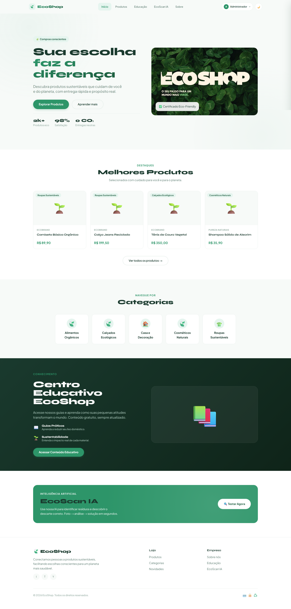
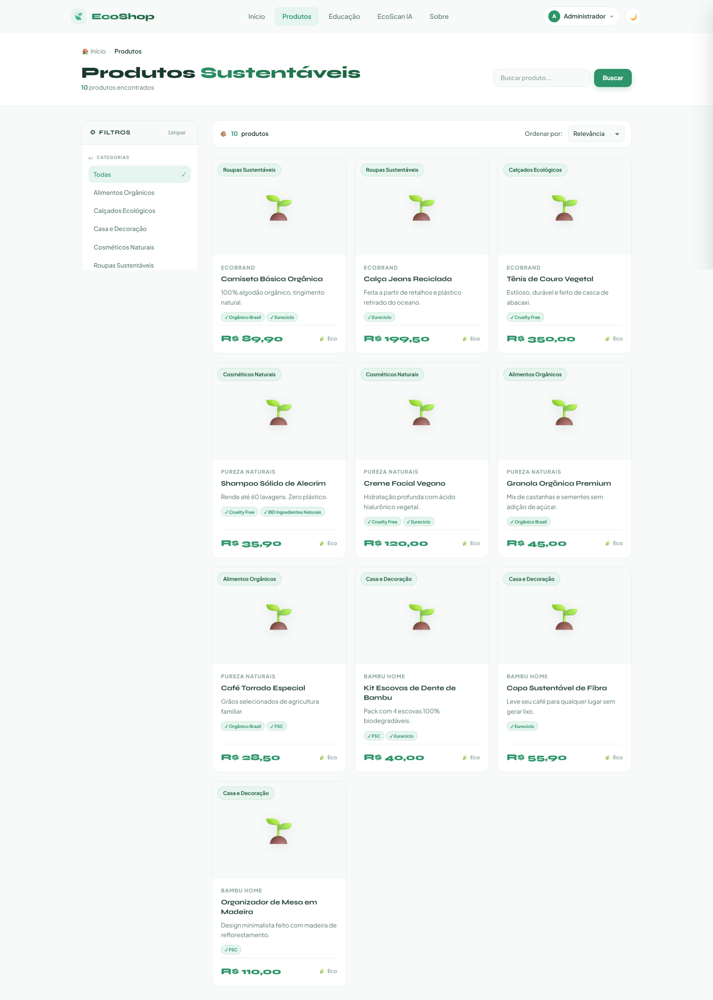
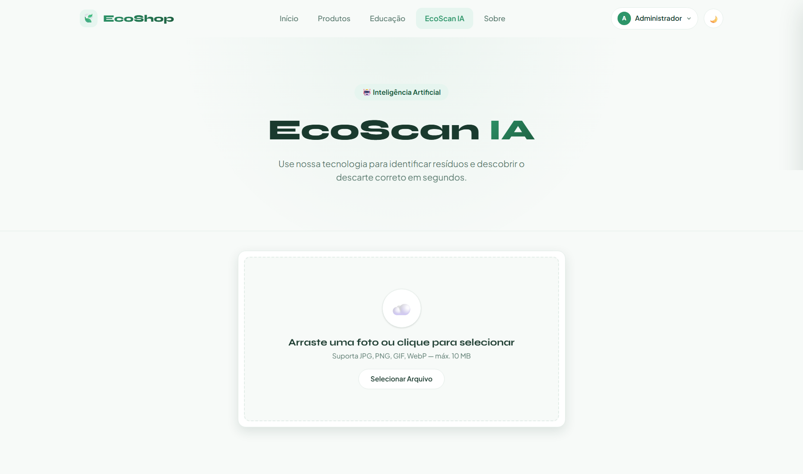
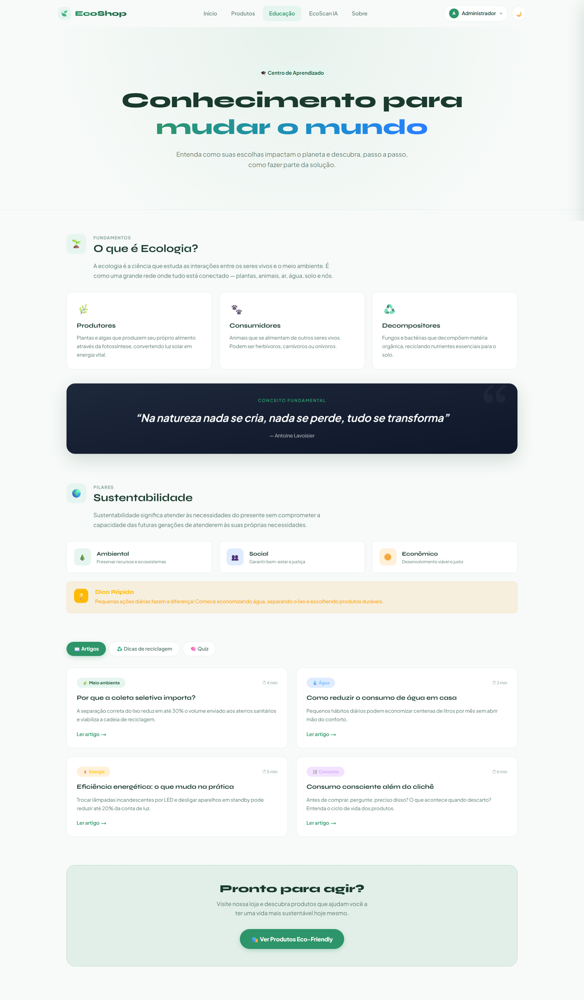
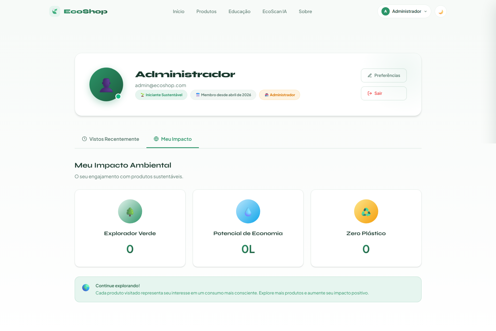
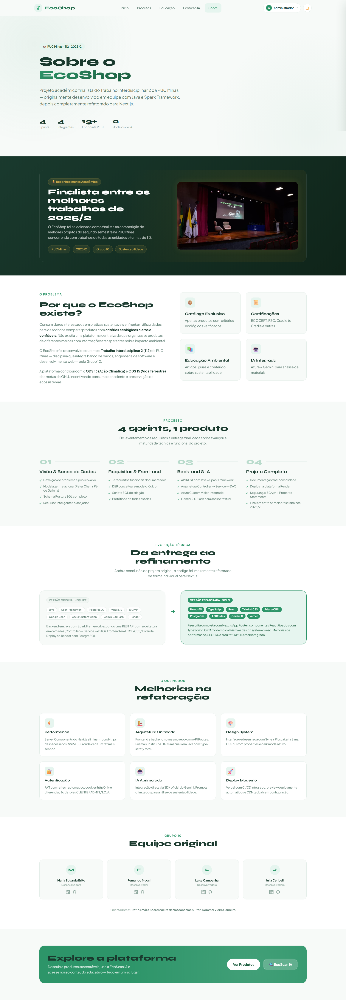
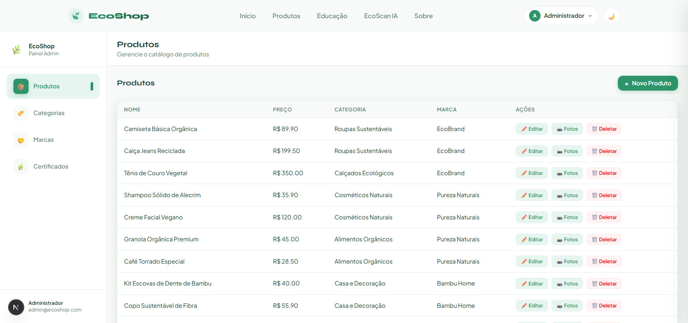

# 🖼️ Interface — EcoShop

> Prints de todas as telas da aplicação. Nenhuma instalação necessária para visualizar.

← [Voltar ao README](./README.md)

---

## 🏠 Home

Página inicial com banner, listagem de categorias dinâmicas e produtos em destaque. Scroll reveal animado na entrada dos elementos.

---

## 🛍️ Catálogo de Produtos

Listagem completa com filtros por categoria e marca, busca em tempo real e cards de produto com preço, certificados e marca responsável.

---

## 📸 IA Scan

Scanner de materiais recicláveis via câmera ou upload de foto. Identifica o material com Azure Custom Vision (confiança ≥ 70%) e retorna análise ambiental detalhada gerada pelo Gemini 2.0 Flash — impacto ambiental, tempo de decomposição, onde descartar, dicas sustentáveis e benefícios da reciclagem.

---

## 🎓 Educação

Seção de conteúdo educacional sobre consumo consciente, reciclagem e sustentabilidade.

---

## 👤 Perfil — Impacto

Área do usuário autenticado com dados pessoais e painel de impacto ambiental acumulado.

---

## ℹ️ Sobre

Página institucional com a proposta do EcoShop, missão e alinhamento com as ODS 13 e 15.

---

## 🗂️ Painel Administrativo

Dashboard restrito a usuários com role `ADMIN`. Gestão completa de produtos, categorias, marcas, certificados e usuários da plataforma.

---
